# BlueSky Ransomware Lab 
[BlueSky Ransomware Lab - Cyberdefender](https://cyberdefenders.org/blueteam-ctf-challenges/bluesky-ransomware/)

SCENARIO: A high-profile corporation that manages critical data and services across diverse industries has reported a significant security incident. Recently, their network has been impacted by a suspected ransomware attack. Key files have been encrypted, causing disruptions and raising concerns about potential data compromise. Early signs point to the involvement of a sophisticated threat actor. Your task is to analyze the evidence provided to uncover the attacker’s methods, assess the extent of the breach, and aid in containing the threat to restore the network’s integrity.

Question 1: Knowing the source IP of the attack allows security teams to respond to potential threats quickly. Can you identify the source IP responsible for potential port scanning activity?  
Open the pcap file with wireshark and the first thing you can see is that there are a ton of RST, ACK packets going from 87.96.21.84 to 87.96.21.81, so you can consider that as port scanning.  
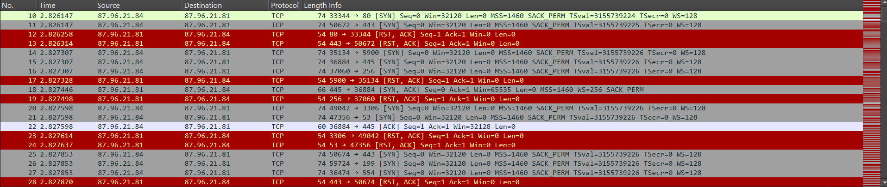
Answer: 87.96.21.84

Question 2: During the investigation, it's essential to determine the account targeted by the attacker. Can you identify the targeted account username?

We observe a large batch of TDS packets where the attacker attempts to submit a malicious payload. These packets likely indicate automated or manual SQL injection attempts or recon activity targeting Microsoft SQL Server.

Let’s apply the tds filter with the ip address from Q1:

ip.src \== 87.96.21.84 && tds

Scrolling through the entires, you see several “TDS7 pre-login message” requests (attempts), but only two “TDS7 login” messages

Opening any of them and examining the login packet will reveal not only the correct answer to this question (the username) but also the password that was provided   
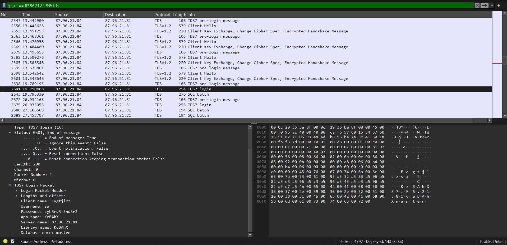 
Answer: sa

Question 3: We need to determine if the attacker succeeded in gaining access. Can you provide the correct password discovered by the attacker?

From Q2, we could have the password: cyb3rd3f3nd3r$  
Answer: cyb3rd3f3nd3r$

Question 4: Attackers often change some settings to facilitate lateral movement within a network. What setting did the attacker enable to control the target host further and execute further commands?  
After finding out the login, let’s stick to the PCAP and examine the first “SQL Batch” entry after the first succesful login using the same query: ip.src \== 87.96.21.84 && tds

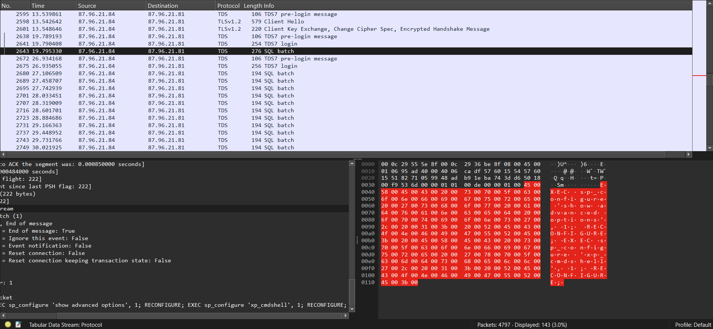 
The answer can be found in the “TDS Query Packet”   
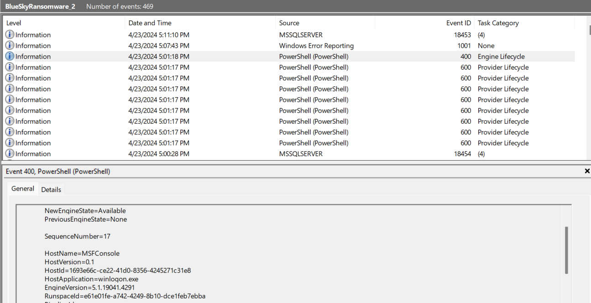 
Answer: xp\_cmdshell  
Question 5: Process injection is often used by attackers to escalate privileges within a system. What process did the attacker inject the C2 into to gain administrative privileges?

Switching to Event ID 400, which logs the start of a PowerShell host, I found one instance containing a hostname string strongly indicative of Metasploit C2 activity: MSFConsole

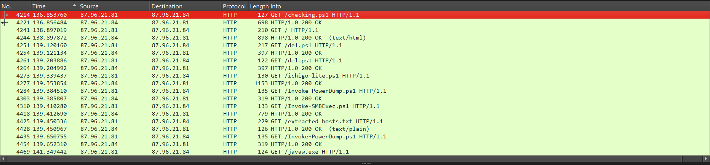  
This event points to winlogon.exe as the process that was injected with the C2 payload.  
Answer:  winlogon.exe

Question 6: Following privilege escalation, the attacker attempted to download a file. Can you identify the URL of this file downloaded?  
Applying the http display filter in Wireshark shows a .ps1 file − a PowerShell script, typically used on Windows systems.  
The first line contains the first file that’s being downloaded, which is the correct answer to Question 6\.  
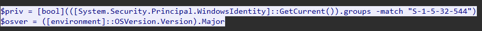

Answer: http://87.96.21.84/checking.ps1

Question 7: Understanding which group Security Identifier (SID) the malicious script checks to verify the current user's privileges can provide insights into the attacker's intentions. Can you provide the specific Group SID that is being checked?  
To answer this, investigate the HTTP Stream by right clicking the request you found in Question 6, then click Follow \-\> HTTP Stream:  
The line containing $priv contains a match on a group SID. This is the built-in Administrators Group SID, and the correct answer to Question 7\.   
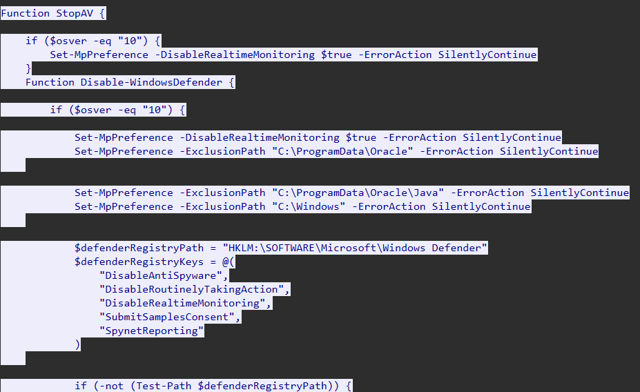
Answer: S-1-5-32-544

Question 8: Windows Defender plays a critical role in defending against cyber threats. If an attacker disables it, the system becomes more vulnerable to further attacks. What are the registry keys used by the attacker to disable Windows Defender functionalities? Provide them in the same order found.  
If you look into the screenshot, you see the Function “StopAV”. My guess is that the keys are there, so let’s scroll a bit down:  
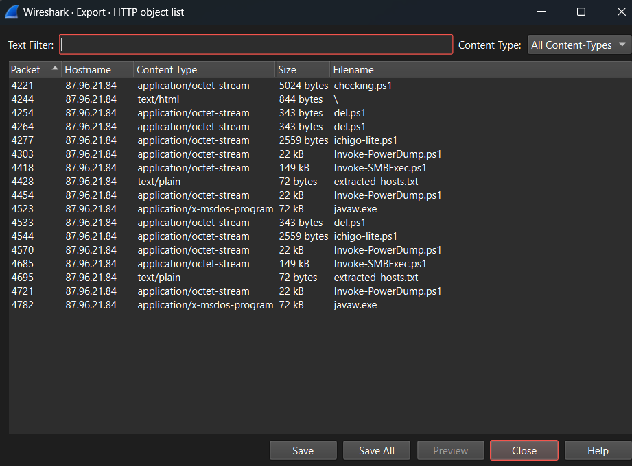

Answer: DisableAntiSpyware, DisableRoutinelyTakingAction, DisableRealtimeMonitoring, SubmitSamplesConsent, SpynetReporting

Question 9: Can you determine the URL of the second file downloaded by the attacker?  
Follow the same method in Q6 but check the second file that’s being downloaded instead of the first OR we can check inside the HTTP object list and find the answer  
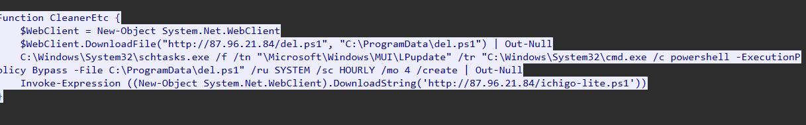 
Answer: http://87.96.21.84/del.ps1

Question 10: Identifying malicious tasks and understanding how they were used for persistence helps in fortifying defenses against future attacks. What's the full name of the task created by the attacker to maintain persistence?

Following the execution path of the first .ps1 script, we find the task name defined within the Function CleanerEtc {} block. The /tn flag specifies the task name.

The command creates a scheduled task that runs C:\\ProgramData\\del.ps1 every 4 hours with SYSTEM privileges (a common technique for maintaining persistence).  
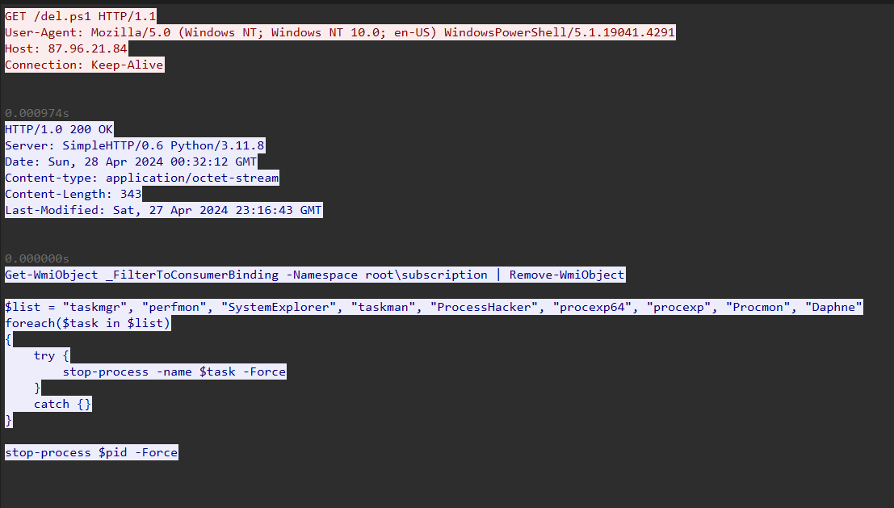

Answer: \\Microsoft\\Windows\\MUI\\LPupdate

Question 11: Based on your analysis of the second malicious file, What is the MITRE ID of the main tactic the second file tries to accomplish?  
To answer this, let’s examine the second file in more detail:  
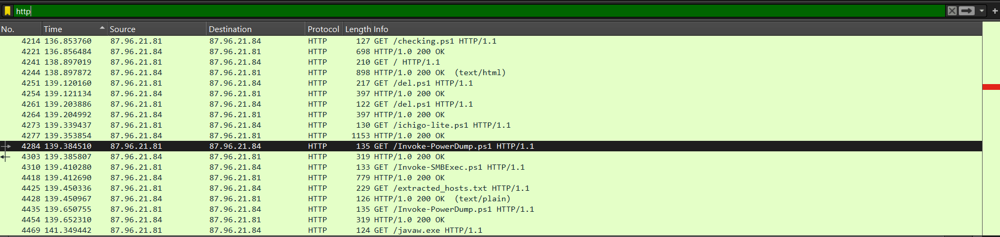
This file attempts to stop different processes that are running on the system, most notably processes that are used for monitoring purposes.

Looking at the MITRE framework, this would fall under “Defense Evasion”.   
Answer: TA0005

Question 12: What's the invoked PowerShell script used by the attacker for dumping credentials?  
Check for the http protocol   
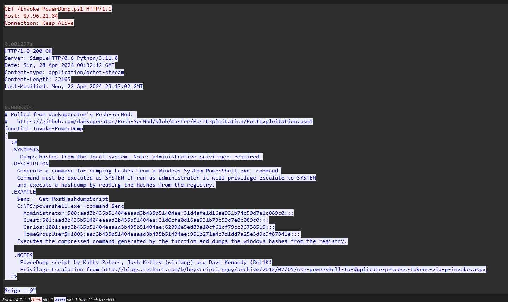 
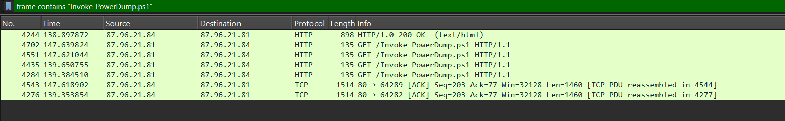
Answer: Invoke-Powerdump.ps1

Question 13: Understanding which credentials have been compromised is essential for assessing the extent of the data breach. What's the name of the saved text file containing the dumped credentials?

investigate the script further by filtering on it using: frame contains “Invoke-Powerdump.ps1”  
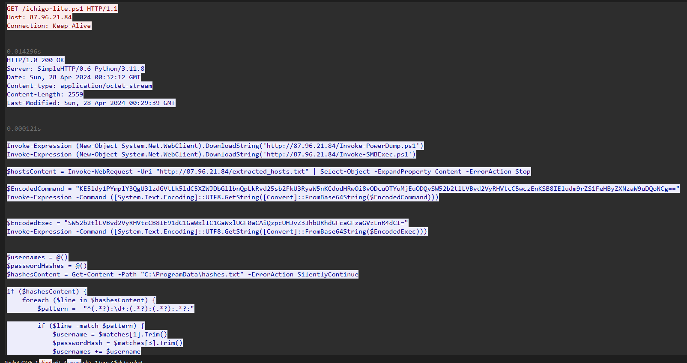

By investigating the requests here, you will find the following request at the bottom (by either looking at packet 4276 or 4543):  
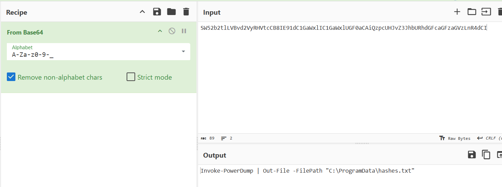

This contains an encoded exec (execution command), that, when decoded, reveals the correct answer to this question  
$EncodedExec \= "SW52b2tlLVBvd2VyRHVtcCB8IE91dC1GaWxlIC1GaWxlUGF0aCAiQzpcUHJvZ3JhbURhdGFcaGFzaGVzLnR4dCI="  
  
Using CyberChef, we obtained the output: Invoke-PowerDump | Out-File \-FilePath "C:\\ProgramData\\hashes.txt"   
Answer: hashes.txt

Question 14: Knowing the hosts targeted during the attacker's reconnaissance phase, the security team can prioritize their remediation efforts on these specific hosts. What's the name of the text file containing the discovered hosts?  
Filtering for http protocol, we can see the extracted\_hosts.txt (which is quite clear the hosts which are extracted to a text file), follow http stream and we can see a list of hosts.   
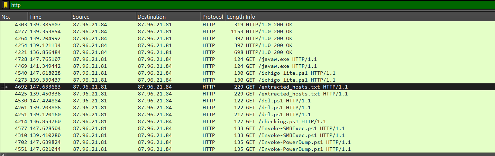 
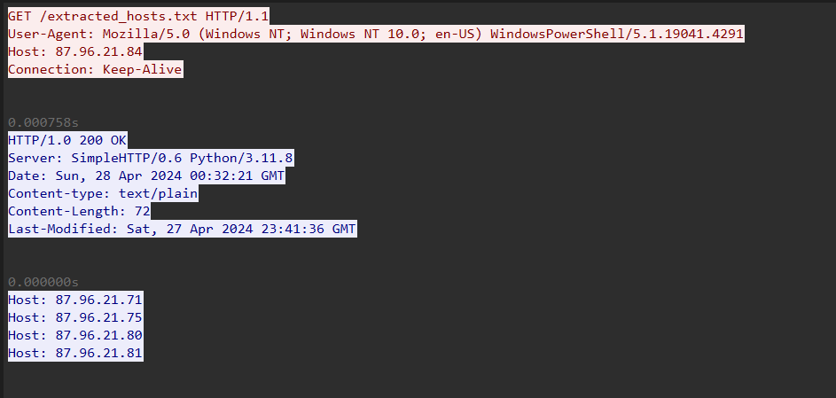 
Answer: extracted\_hosts.txt

Question 15: After hash dumping, the attacker attempted to deploy ransomware on the compromised host, spreading it to the rest of the network through previous lateral movement activities using SMB. You’re provided with the ransomware sample for further analysis. By performing behavioral analysis, what’s the name of the ransom note file?

Let’s download the .exe file and “explode” it using the any.run service:  
  
Answer: \# DECRYPT FILES BLUESKY \# 

Question 16: In some cases, decryption tools are available for specific ransomware families. Identifying the family name can lead to a potential decryption solution. What's the name of this ransomware family?

From the Q15, we could say that the ransomware family is bluesky  
Answer: bluesky
