**HoneyBOT Lab Writeup**

[HoneyBOT Lab](https://cyberdefenders.org/blueteam-ctf-challenges/honeybot/)

Scenario: A PCAP analysis exercise highlighting attacker's interactions with honeypots and how automatic exploitation works.. (Note that the IP address of the victim has been changed to hide the true location.)

As a soc analyst, analyze the artifacts and answer the questions.

First, what is HoneyBot? A honeypot is a cybersecurity deception tool—a decoy system designed to attract and trap attackers, diverting them from real assets and providing valuable intelligence on their tactics, tools, and motives. By mimicking legitimate-looking, but fake, targets, organizations can study attacker behavior, detect threats early, and use the gathered threat intelligence to improve their real security defenses.

**Q1: What is the attacker's IP address?**

Captured traffic is by navigating to Statistics \> Endpoints and selecting the IPv4 tab.  

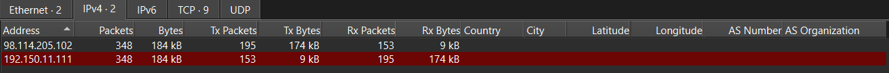 

One IP address has significantly higher transmitted bytes compared to received bytes, so it might be the initiator of the communication. In this case, the address 98.114.205.102 appears to be the most active in transmitting data, while 192.150.11.111 shows a pattern of primarily receiving data.   
So, I believe that the IP address of 98.114.205.102 must be the attacker, and the latter IP is the victim. 
To further validate this finding, we examine the first few packets in the network capture.  
The attack begins with 98.114.205.102 sending a TCP SYN packet to 192.150.11.111 on port 445, which is commonly associated with the Server Message Block (SMB) protocol. 

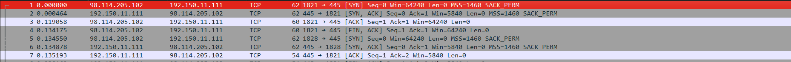
 
Answer: 98.114.205.102

**Q2: What is the target's IP address?**

From Q1, we know that the target's IP address is 192.150.11.111.

**Q3: Provide the country code for the attacker's IP address (a.k.a geo-location).**  
Use [IP2location](https://www.ip2location.com/), we can find out about the country code from the attacker’s IP address  

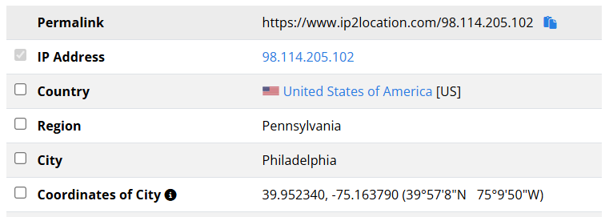 

Answer: US

**Q4: How many TCP sessions are present in the captured traffic?**

"A TCP session represents a complete connection between two endpoints, following the TCP three-way handshake process, which consists of SYN, SYN-ACK, and ACK packets."

By navigating to Statistics \> Conversations and selecting the TCP tab, we obtain a detailed breakdown of all TCP connections in the PCAP file.

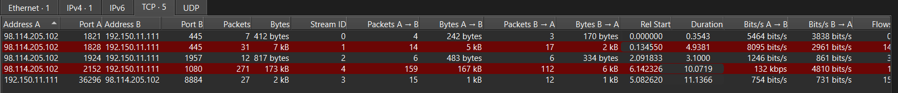  

Answer: 5

**Q5: How long did it take to perform the attack (in seconds)?**

"To determine how long the attack lasted, Wireshark's Capture File Properties feature is utilized, providing key metadata about the packet capture, including timestamps that mark the beginning and end of the recorded network activity."
Navigating to Statistics \> Capture File Properties, the capture details reveal the First packet timestamp and the Last packet timestamp, indicating when the first and last recorded network interactions occurred.

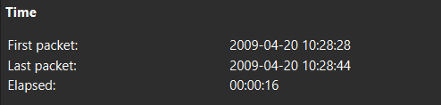

Answer: 16

**Q6: Provide the CVE number of the exploited vulnerability.**

Analyzing network traffic can reveal signs of exploitation attempts, especially when certain protocols associated with known vulnerabilities are present. One such protocol is DCE/RPC (Distributed Computing Environment / Remote Procedure Call), which is used for remote management and execution of services on Windows systems. This protocol is often exploited in attacks targeting Microsoft Windows, particularly when used in combination with SMB (Server Message Block).

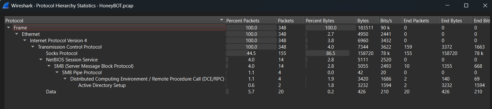

"DCE/RPC is widely used in Windows environments for remote management, system administration, and Active Directory operations. However, this protocol has been historically vulnerable to exploitation, particularly when used over SMB named pipes, which allow for remote execution of privileged commands. Attackers frequently abuse these services to gain unauthorized access, escalate privileges, or manipulate domain controller settings. To identify the specific vulnerability being exploited, Wireshark’s Protocol Hierarchy Statistics feature was used. The breakdown of protocols in the network traffic highlights the presence of SMB named pipes and DCE/RPC traffic, specifically involving the DsRolerUpgradeDownlevelServer operation."
The presence of these requests in the capture indicate an attempted privilege escalation attack. Applying a dcerpc filter in Wireshark allows us to further investigate the network packets related to this attack. The traffic log shows that the attacker’s IP address, 98.114.205.102, sent an RPC Bind request to the victim system at 192.150.11.111, establishing a remote session. This is followed by a DsRolerUpgradeDownlevelServer request, which is a function within Windows RPC that allows an attacker to alter domain controller settings.

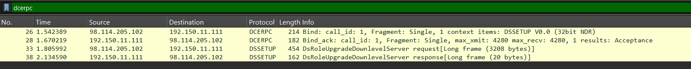

The response from the victim system confirms successful execution, as indicated by the Windows Error Code: WERR\_OK (0x00000000).  

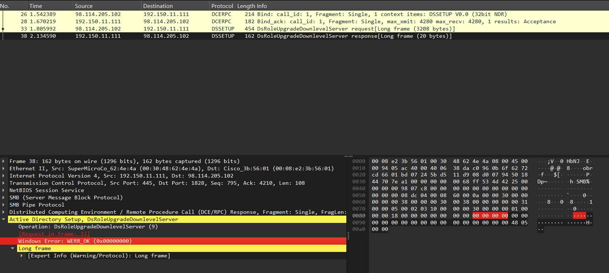 

The attacker likely leveraged this function to elevate privileges or manipulate the domain configuration remotely. The observed attack pattern corresponds to CVE-2003-0533, a remote code escalation vulnerability in Microsoft Local Authority Security Subsystem Service (LSASS.exe).  

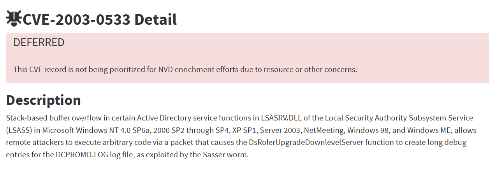

**Q7: Which protocol was used to carry over the exploit?**  
The exploit observed in this network capture was carried over the SMB (Server Message Block) protocol, specifically through SMB named pipes facilitating DCE/RPC (Distributed Computing Environment / Remote Procedure Call) communication. 

**Q8: Which protocol did the attacker use to download additional malicious files to the target system?**

After gaining access to the victim system, the attacker attempts to download and execute additional malicious files. A thorough inspection of the Protocol Hierarchy Statistics in Wireshark shows that a notable portion of the network traffic is categorized under raw data transmission.  
By applying a data filter in Wireshark, we can isolate and examine the relevant packets. Within the filtered results, a TCP-based communication between the attacker’s IP 98.114.205.102 and the victim system 192.150.11.111 reveals a command sequence that resembles an FTP (File Transfer Protocol) script.

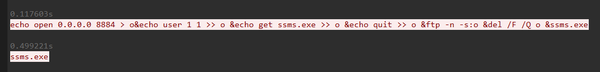

**Q9: What is the name of the downloaded malware?**

Based on the analysis of the executed command in the previous question, the attacker downloaded an executable file named smss.exe over FTP.

**Q10: The attacker's server was listening on a specific port. Provide the port number.**

Based on the previous command analysis, the attacker connected to the server on port 8884, which is a non standard FTP port.

**Q11: When was the involved malware first submitted to VirusTotal for analysis? Format: YYYY-MM-DD**

TCP Stream 4 contains the actual file:

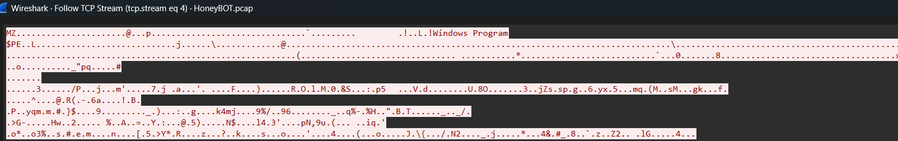

We can use Follow –\> TCP Stream and then save it (in Raw mode) for further analysis.  
md5sum shell.bin  
14a09a48ad23fe0ea5a180bee8cb750a

Searching for the Hash on Virus Total shows that it was first submitted in 2007  

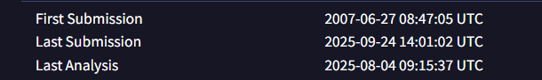

**Q12: What is the key used to encode the shellcode?**

The attack observed in this scenario exploits a buffer overflow vulnerability in the LSASS service, specifically targeting CVE-2003-0533. A buffer overflow attack occurs when an attacker sends more data than the allocated memory buffer can handle, leading to unintended code execution. In this case, the exploit payload contains a large buffer filled with specific byte patterns, including a NOP sled, which is a sequence of 0x90 (NOP) instructions.   
To analyze the shellcode, it was processed using scdbg, a shellcode emulator that allows for safe execution and debugging of malicious code. Running scdbg on the extracted shellcode revealed key Windows API calls used by the exploit, including GetProcAddress, LoadLibraryA, and CreateProcessA.

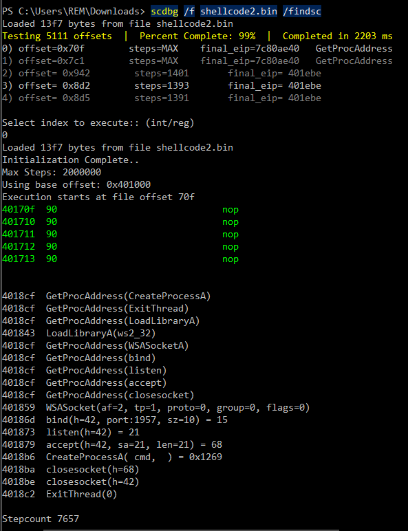

These functions indicate that the shellcode is designed to open a reverse shell or execute commands on the target machine. Additionally, scdbg provided insight into the structure of the shellcode, showing that it dynamically resolves function addresses to execute system-level actions.   
A closer inspection of the shellcode execution flow revealed the presence of XOR-based obfuscation. Attackers often use XOR encoding to disguise malicious payloads, making them harder to detect using traditional signature-based security tools. By running scdbg with verbose logging enabled, the /v option, it became evident that the shellcode employs an XOR operation to decode itself before execution.

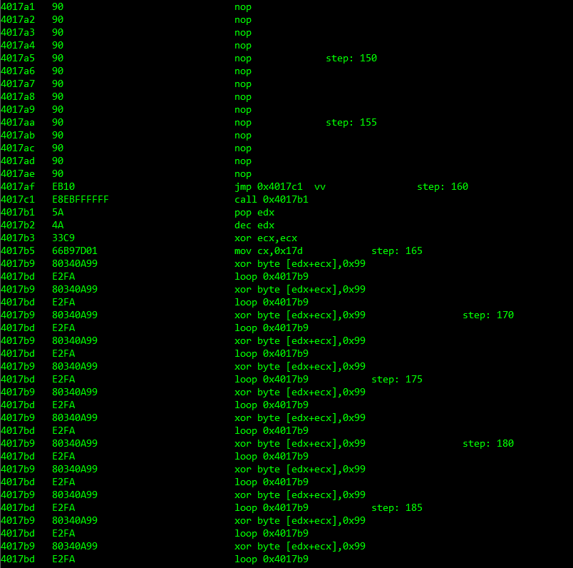

The XOR decryption loop applies a static XOR key to the encoded data, revealing the original shellcode instructions. The analysis confirmed that the key used in the XOR decryption routine is 0x99, meaning that every byte of the encoded shellcode was XOR’d with this value before execution.

**Q13: What is the port number the shellcode binds to?**

The output from scdbg revealed a sequence of Windows API calls, including GetProcAddress, LoadLibraryA, and CreateProcessA, which are commonly used in malware to dynamically load libraries and execute system commands. A crucial discovery in the analysis was the presence of WSASocketA and bind system calls, which indicate that the shellcode attempts to establish a network listener.

  

Answer: 1957

**Q14: The shellcode used a specific technique to determine its location in memory. What is the OS file being queried during this process?**

The shellcode uses multiple calls to GetProcAddress, which is a function of Kernel32.dll.
