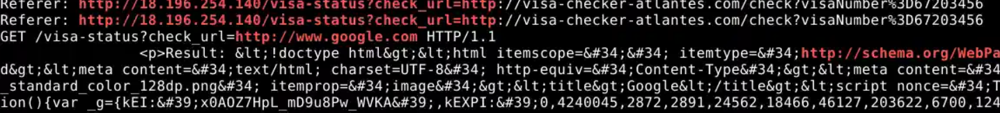

# IMDSv1
Server-side request forgery is a web security vulnerability that allows an attacker to cause the server-side application to make requests to an unintended location.

1. The attacker tested the SSRF vulnerability by accessing an external website. What URL was used to conduct this test?

An attacker testing SSRF often does something like: GET /fetch?url=http://attacker.com/test

Using this command: strings 'Visa Checker.pcap' |grep 'http://\[a-zA-Z0-9./?=\_%-\]\*'  
to check for External URLs (non-internal IPs or domains)  
And we obtain this GET /visa-status?check\_url=http://www.google.com HTTP/1.1

 
Answer: http://www.google.com

2. The attacker exploited the vulnerable website to send requests, ultimately obtaining the IAM role credentials. What is the exact URI used in the request made by the webserver to acquire these credentials?

Check in pcap file to see which packet contain this URL

 
 
Answer: [http://169.254.169.254/latest/meta-data/iam/security-credentials/EC2-S3-Visa](http://169.254.169.254/latest/meta-data/iam/security-credentials/EC2-S3-Visa)

3. The attacker executed an AWS CLI command, similar to whoami in traditional systems, to retrieve information about the IAM user or role associated with the operation. When exactly did he execute that command?

check the log using the command line:   
grep \-i "get-caller-identity" 124355653975\_CloudTrail\_eu-central-1\*.json  

So, we obtain "eventTime\\":\\"2024-10-15T10:20:45Z\\"   
Answer: 2024-10-15 10:20

4. During the investigation of the network traffic, we observed that the attacker attempted to retrieve the instance ID and subsequently tried to terminate or shut down the instance. What was the error code returned?

Find eventName like “TerminateInstances” or “StopInstances” in logs using these 2 command line:   
grep \-i '"TerminateInstances"' 124355653975\_CloudTrail\_eu-central-1\*.json  
grep \-i "StopInstances" 124355653975\_CloudTrail\_eu-central-1\*.json  
 
From this we obtain the message: \\"errorCode\\":\\"Client.UnauthorizedOperation\\"

Answer: Client.UnauthorizedOperation

5. The attacker made an attempt to create a new user but lacked the necessary permissions. What was the username the attacker tried to create?

To detect the creation of a new IAM user using AWS CloudTrail, we need to search for the event: “CreateUser”  
Same for the above question, search inside the logs using this command line:  
grep \-i “CreateUser” 124355653975\_CloudTrail\_eu-central-1\*.json

  
We obtain “iam:CreateUser on resource: arn:aws:iam::124355653975:user/H3ll because no identity-based policy allows the iam:CreateUser action\\”  
Answer: H3ll

6. Which version of the AWS CLI did the attacker use?

From question number 5, we can also obtain the aws cli the attacker used: aws-cli/2.18.5  
 
Answer: aws-cli/2.18.5

7. After listing the available S3 buckets, the attacker proceeded to list the contents of one of them, Which bucket did the attacker list its contents?  
   Search the internet for eventName related to this include: “listObjects”, “listBuckets”, “listObjectsv2”  
     
   From this we found the "bucketName\\":\\"tourists-visa-info\\"  
     
   Answer: tourists-visa-info  
     
8. The attacker subsequently began downloading data from the bucket. What was the total amount of data stolen, measured in bytes?  
   We know that eventName \= GetObject (used when downloading objects from S3)  
   Using this command:   
   strings \*| grep GetObject | grep \-o '"bytesTransferredOut\\\\":\[0-9\]\\+' |awk \-F: '{sum+=$2}END {print sum}'  
     
   
   Answer: **5449252456**  
9. After stealing the data, the attacker began deleting the contents of the bucket. What IP address was used during these deletion activities?  
   The eventName for deletion activities is “DeleteObject” so use this command:  
   strings \*|grep "DeleteObject"  
    
   We found the ip address related to that event: "sourceIPAddress\\":\\"193.189.100.204\\"  
     
   Answer: 193.189.100.204  
10. The attacker executed a deletion operation on the bucket, removing all of its contents. Every request in AWS is linked to a unique identifier for tracking purposes. What was the request ID associated with the bucket's deletion event?

So the eventName related to removing bucket is “DeleteBucket” so we try to find it using this command: strings \*|grep "DeleteBucket"  

"requestID\\":\\"XT27FP62J3ACKDNW\\"  
Answer: XT27FP62J3ACKDNW  

