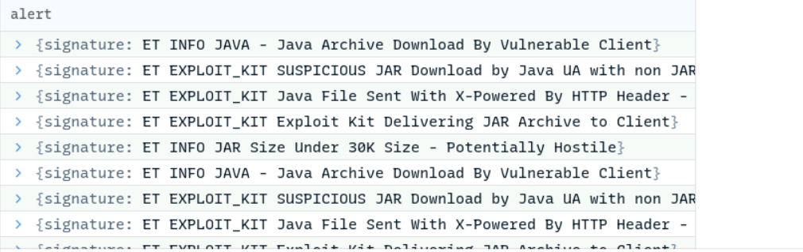

# Malware Traffic Analysis 1 Lab

1. **What is the IP address of the Windows VM that gets infected?**

In this view we can see the top 3 communicators:  
172.16.165.165 	private IP  
37.200.69.143	public IP  
74.125.233.96	public IP  
  
As we can see the first one is a private IP and is communicating with several public IPs.   
Answer: 172.16.165.165 

2. **What is the IP address of the compromised web site?**

In Wireshark, go to Statistics \> HTTP \> Requests to see a list of websites accessed by the infected machine. The compromised site should have an unusual number of requests.  
 
we can see that the website: www.ciniholland.nl has made a bunch of requests but we cannot come to a conclusion yet.  
Now, in wireshark query for: http && ip.addr \== 172.16.165.165  

we can see that the IP address 82.150.140.30 belongs to www.ciniholland.nl  
Filtering our PCAP by that IP:

And selecting the first packet (GET / HTTP/1.1) we can use Wireshark “Follow Stream” to follow the communication between each packet.

Right-click in that packet and choose Follow \> TCP stream.

In this window we can follow all the communication sequence where blocks in red shows the client-side packets and blocks in blue, the server-side packets.

Finding “hidden” elements is always a good place to start. On the bottom of the TCP Stream window do:  Find \= hidden  

Looking at the whole script where a “hidden” (in grey) was found we can see other 2 websites “http://24corp-shop.com” and “http://adultbiz.in” that we found suspicious.  
Answer: 82.150.140.30

3. **What is the IP address of the server that delivered the exploit kit and malware?**

Use Brim with a filter like event\_type='alert' to identify alerts related to the exploit kit and malware delivery.  
  
Answer: 37.200.69.143

4. **What is the FQDN of the compromised website?**

As from question 2, we have the answer: ciniholland.nl

5. **What is the FQDN that delivered the exploit kit and malware?**

From question 3,  we found the src ip related to the exploit kit and malware : 37.200.69.143  
In networkminer, we found the website related to this src ip   
 
Answer: stand.trustandprobaterealty.com

6. **What is the redirect URL that points to the exploit kit (EK) landing page?**

In wireshark, query for ip.addr \== 37.200.69.143   
****  
Then follow TCP stream.

****  
We can see that the redirect URL that points to the exploit kit (EK) landing page is: http://24corp-shop.com/  
Answer: http://24corp-shop.com/

7. **Other than CVE-2013-2551 IE exploit, another application was targeted by the EK and starts with "J". Provide the full application name.**

Apply the filter ***event\_type=='alert' dest\_ip==172.16.165.165 | cut alert.signature*** in Brim, and check the alert field for signatures or files indicating other applications targeted by the EK.  
 
Answer: Java

8. **How many times was the payload delivered?**

Open again the list of HTTP requests: Go to File \> Export Objects \> HTTP….

We can see 3 requests with application/x-msdownload  
****  
Answer: 3

9. **The compromised website has a malicious script with a URL. What is this URL?**

From question 2, we can see the hidden element on a script that was calling out to:   
http://24corp-shop.com/  
 
Answer: http://24corp-shop.com/

10. **Extract the two exploit files. What are the MD5 file hashes? (comma-separated )**

****  
Answer: 7b3baa7d6bb3720f369219789e38d6ab,1e34fdebbf655cebea78b45e43520ddf

