# XLMRat Lab
[XLMRat Lab](https://cyberdefenders.org/blueteam-ctf-challenges/xlmrat/)

SCENARIO: A compromised machine has been flagged due to suspicious network traffic. Your task is to analyze the PCAP file to determine the attack method, identify any malicious payloads, and trace the timeline of events. Focus on how the attacker gained access, what tools or techniques were used, and how the malware operated post-compromise.

Before reading the questions, I take a look at the pcap file. 

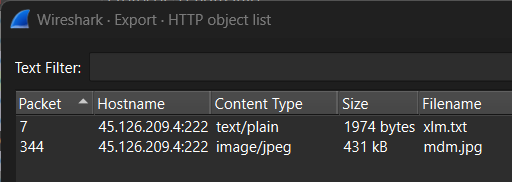

File → Export Objects → HTTP gives us 2 files:
- xlm.txt
- mdm.jpg
QUESTION 1: The attacker successfully executed a command to download the first stage of the malware. What is the URL from which the first malware stage was installed?
The first file downloaded, xlm.txt is a stage 1 dropper. But not the malware itself.
xlm.txt contains the VBScript loader.
It calls PowerShell, which downloads mdm.jpg (probably not an image, but a disguised script).
Executes the downloaded code in memory (IeX = Invoke-Expression).
Uses common obfuscation and evasion techniques:
- String concatenation
- Hidden PowerShell window (-WindowStyle Hidden)
- Execution policy bypass (-ExecutionPolicy Bypass)
- No profile (-NoProfile)
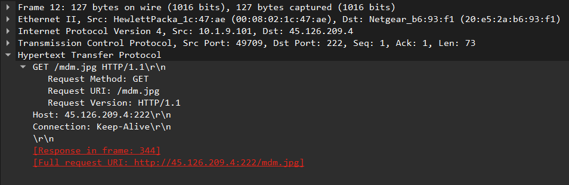

QUESTION 2: Which hosting provider owns the associated IP address?
The IP address can be found easily, which is 45.126.209.4 
Using whois lookup, we can find this IP belongs to ReliableSite.net
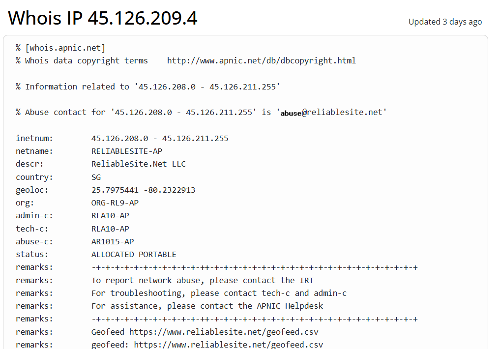

QUESTION 3: By analyzing the malicious scripts, two payloads were identified: a loader and a secondary executable. What is the SHA256 of the malware executable?
Analyze the mdm.jpg file, we found the script with a long hex blob stored in the $hexString_bbb variable which is the malware executable. 
1. I extract the $hexString_bbb variable, start from "4D_5A_90_00_03_00_00....." until the start of $hexString_pe
2. I copied this hex string to Cyberchef using "From Hex" 
3. Then, I download the ouput into a download.dat file
4. To check for SHA256, I use sha256 sum download.dat (or whatever you save your output name)
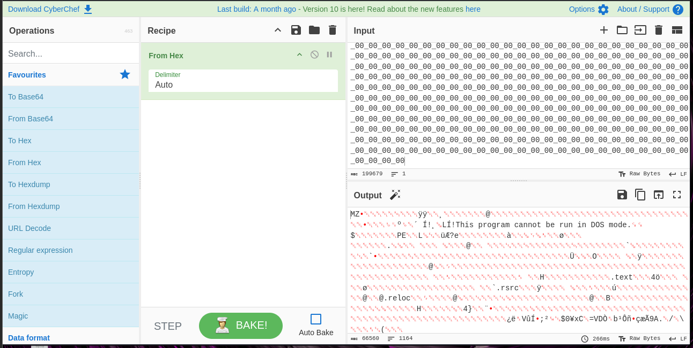
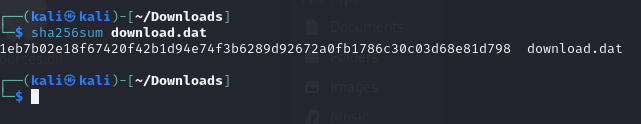

QUESTION 4: What is the malware family label based on Alibaba?
Using the SHA256 hash from Question 3, then go to VirusTotal, we can find the family label for this malware
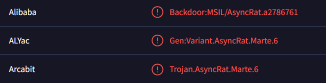

QUESTION 5: What is the timestamp of the malware's creation?
In the History part of Details section, we can find the Creation of this malware
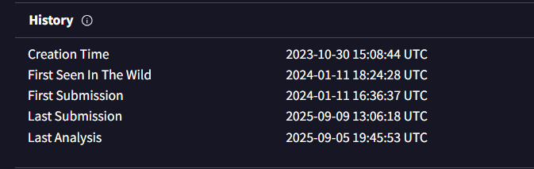

QUESTION 6: Which LOLBin is leveraged for stealthy process execution in this script? Provide the full path.
For this part, I look up the information for [LOLBin](https://socprime.com/blog/what-are-lolbins/)
You can write python or any other type of language to extract from the script, but this one is simple and we can see clearly from the script 
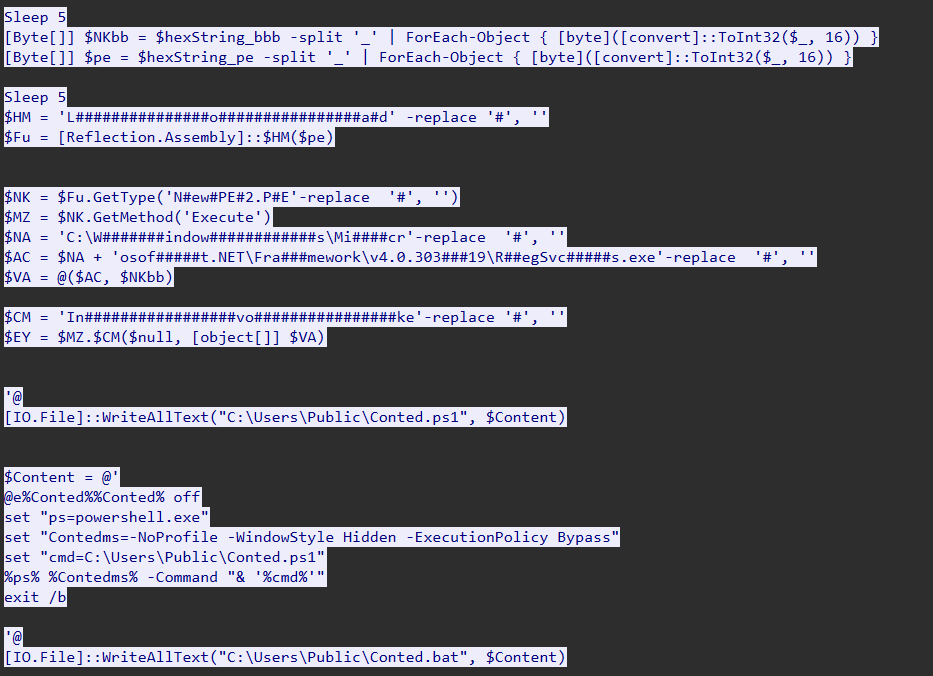
Answer: C:\Windows\Microsoft.NET\Framework\v4.0.30319\RegSvcs.exe

QUESTION 7: The script is designed to drop several files. List the names of the files dropped by the script.
From the script, we can see a bunch of files being dropped 
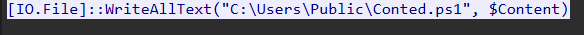
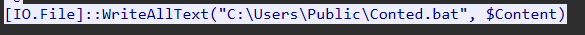
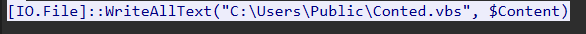
