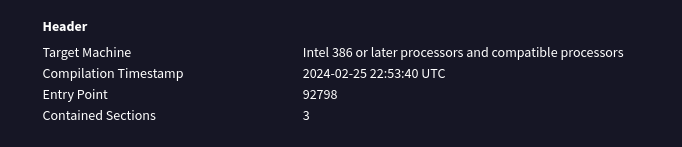
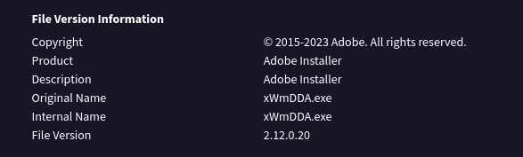
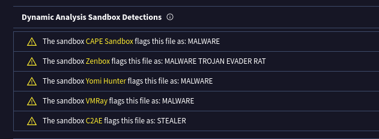
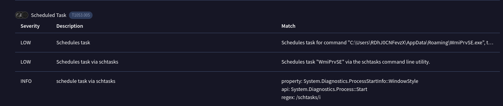
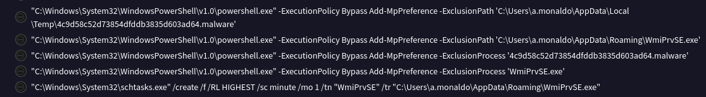
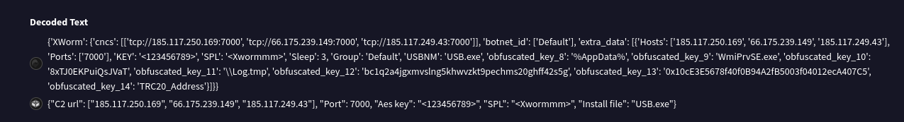
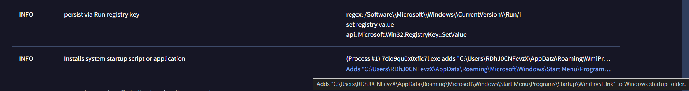
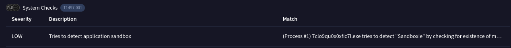
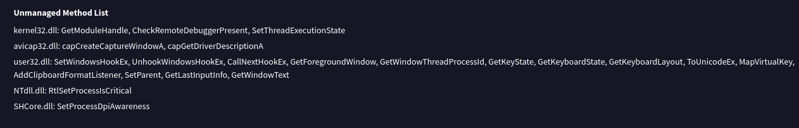

# XWorm Lab Writeup
[XWorm Lab](https://cyberdefenders.org/blueteam-ctf-challenges/xworm/)

SCENARIO: An employee accidentally downloaded a suspicious file from a phishing email. The file executed silently, triggering unusual system behavior. As a malware analyst, your task is to analyze the sample to uncover its behavior, persistence mechanisms, communication with Command and Control (C2) servers, and potential data exfiltration or system compromise.

Q1: What is the compile timestamp (UTC) of the sample?

"A compilation timestamp is a record embedded within compiled software that indicates the exact date and time a program was compiled and sometimes the version of the compiler used. This digital record helps track when a piece of code was built, ensuring its integrity and allowing for debugging by providing a point of reference in the development process."

I uploaded the given XWorm malware file to VirusTotal, inside the Details section, we can find the Compilation Timestamp in the Header part.

Answer: 2024-02-25 22:53 

Q2: Which legitimate company does the malware impersonate in an attempt to appear trustworthy?

The legitimate company information can be found in the File Version Information section inside the Details tab on VirusTotal. 

Answer: Adobe

Q3: How many anti-analysis checks does the malware perform to detect/evade sandboxes and debugging environments?

Several sandbox detections can be found in the Behavior tab, under the Dynamic Analysis  Sandbox Detections section. Count them and I conclude that 5 anti-analysis checks were done to detect/evade sandboxes.

Answer: 5

Q4: What is the name of the scheduled task created by the malware to achieve execution with elevated privileges?

I observed scheduled tasks inside Execution section of the “MITRE ATT&CK Tactics and Techniques” inside the Behavior tab.

Answer: WmiPrvSE 

Q5: What is the filename of the malware binary that is dropped in the AppData directory?

From Q4, we can see the the schedules task:"Schedules task for command "C:\Users\RDhJ0CNFevzX\AppData\Roaming\WmiPrvSE.exe", to be triggered by TIME. Task has been rescheduled by the analyzer."
Besides, I observed that the scheduled task and the malware binary filename contain similar patterns or naming conventions.

Answer: WmiPrvSE.exe

Q6: Which cryptographic algorithm does the malware use to encrypt or obfuscate its configuration data?
During a more detailed analysis of the Behavior tab, I discovered a significant Decoded Text section containing key information related to encryption and other relevant details.

I found the Aes key, which point to the fact that AES might be the cryptographic algorithm used by the attacker.

Answer: Aes

Q7: To derive the parameters for its encryption algorithm (such as the key and initialization vector), the malware uses a hardcoded string as input. What is the value of this hardcoded string?

The keyword here is “key” so I observed and found that “obfuscated_key_10” might be the answer

Answer: 8xTJ0EKPuiQsJVaT

Q8: What are the Command and Control (C2) IP addresses obtained after the malware decrypts them? 

From Q6, we see that the C2 URL include: 185.117.250.169, 66.175.239.149, 185.117.249.43

Q9: What port number does the malware use for communication with its Command and Control (C2) server?

Answer: Port: 7000

Q10: The malware spreads by copying itself to every connected removable device. What is the name of the new copy created on each infected device?

Answer: usb.exe

Q11: To ensure its execution, the malware creates specific types of files. What is the file extension of these created files?

I did a little research on this and found out that attackers use “lnk” files, or Windows shortcuts, as a stealthy way to deliver malware. Besides, from the above questions we know that WmiPrvSE.exe is a malicious file dropped by the malware, connecting the dot I believe that "lnk" is the answer.

Answer: lnk

Q12: What is the name of the DLL the malware uses to detect if it is running in a sandbox environment?

In the Discovery section of “MITRE ATT&CK Tactics and Techniques”, we can see that the attacker tried to detect application sandbox 
"(Process #1) 7clo9qu0x0xfic7l.exe tries to detect "Sandboxie" by checking for existence of module "SbieDll.dll"."

Answer: SbieDll.dll

Q13: What is the name of the registry key manipulated by the malware to control the visibility of hidden items in Windows Explorer?

The registry key that controls the visibility of hidden items in Windows Explorer is located at “HKEY_CURRENT_USER\Software\Microsoft\Windows\CurrentVersion\Explorer\Advanced”
I looked for this registry key and found this 

ShowSuperHidden decides whether Windows Explorer should display system-critical hidden files that are normally invisible.

Answer: ShowSuperHidden

Q14: Which API does the malware use to mark its process as critical in order to prevent termination or interference?

I observed an Unmanaged Methods list containing lots of API functions inside the Details tab.
One of these functions is used by the malware to mark its process as critical preventing it from being terminated or interfered with.

Answer: RtlSetProcessIsCritical

Q15: Which API does the malware use to insert keyboard hooks into running processes in order to monitor or capture user input?

I found out that this Unmanaged Methods list also include "SetWindowsHookEx" which can be used to inject a DLL into another process in order to capture user input.

Answer: SetWindowsHookEx

Q16: Given the malware’s ability to insert keyboard hooks into running processes, what is its primary functionality or objective?

Malware, specifically keyloggers, inserts itself into running processes by leveraging operating system features to "hook" keyboard events, allowing it to capture keystrokes before they are processed by legitimate applications.
